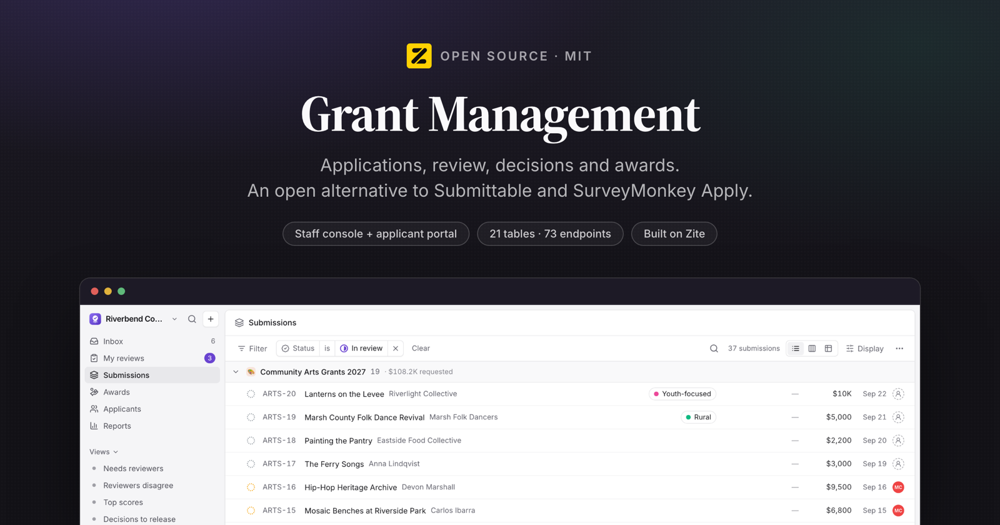
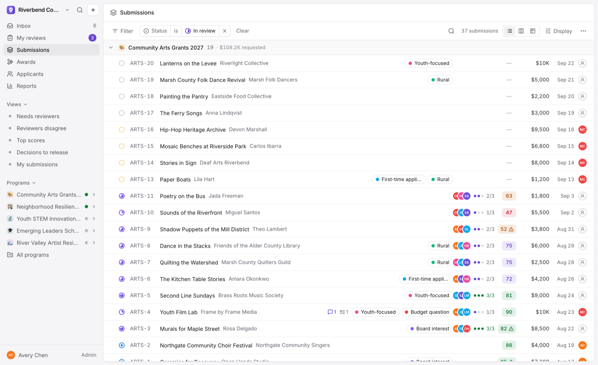
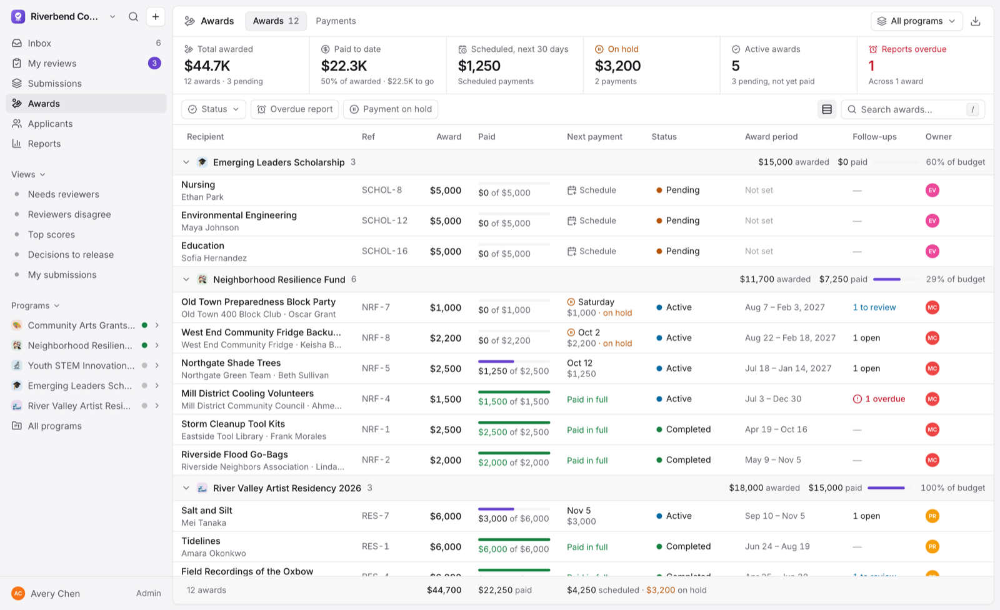
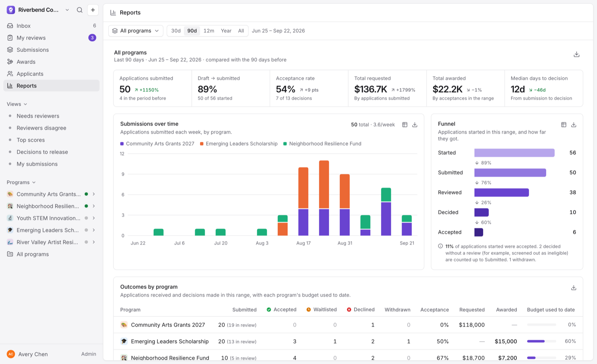
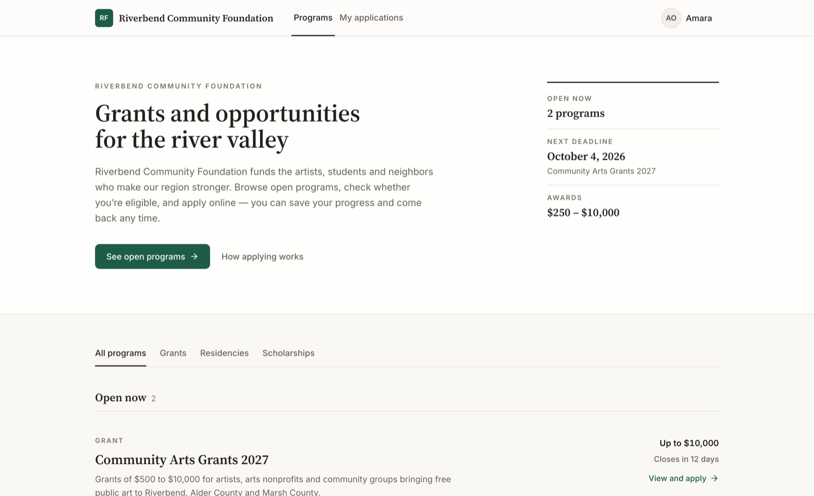

<p align="center">
  
</p>

<h3 align="center">Grant Management</h3>

<p align="center">
  Open-source grants management: applications, blind review, decisions and awards.
  <br/>
  An open alternative to <b>Submittable</b> and <b>SurveyMonkey Apply</b>.
</p>

<p align="center">
  <a href="#whats-in-it">Features</a> ·
  <a href="#install-it-in-your-own-workspace">Install</a> ·
  <a href="#how-it-works">How it works</a> ·
  <a href="#local-development">Development</a> ·
  <a href="https://developers.zite.com">Zite docs</a>
</p>

<p align="center">
  <a href="LICENSE"></a>
  <a href="https://github.com/zite/grant-management/stargazers"></a>
  <a href="https://www.npmjs.com/package/zitejs"></a>
</p>

---

## What this is

Applications, review, decisions and awards for grantmakers, nonprofits, and anyone
who runs a selection process.

This is a **Zite solution**, meaning a workspace you install into your own
[Zite](https://zite.com) account and then edit. Zite provides the Postgres
database, the endpoint runtime, auth and hosting. Everything above that is the
~56,000 lines of TypeScript in this repository.

Two apps share one database:

| App | Directory | Who uses it | Access |
| --- | --- | --- | --- |
| **Grant Management** | `apps/grant-management` | Staff and reviewers: build programs and forms, triage and review submissions, decide, pay awards, report | Internal (organization members) |
| **Applicant Portal** | `apps/applicant-portal` | Applicants: find programs, check eligibility, apply, track status, answer follow-ups. Volunteer reviewers: score assigned applications | External (public, with sign-in) |

A new workspace starts empty. To look around first, an admin can load a sample
foundation from Settings → General: Riverbend Community Foundation, with five
programs and 68 submissions across every stage. The same page removes it again.

<p align="center">
  
</p>

---

## What's in it

### For staff (Grant Management)

- **Programs.** Grants, scholarships, fellowships, awards and open calls, each with its own
  key (`ARTS-42`), opening date and timezone-aware deadline, late-submission policy, budget,
  stages (Intake → Review → Decision, renameable and reorderable), rubric per stage, reviewer
  pool, blind review and a draft → published → closed → archived lifecycle. An overview
  tab shows submissions over time, stage funnel, review progress and budget committed.
- **Form builder.** Sections as steps, 14 question types (text, long text with word limits,
  email, phone, URL, number, currency, date, single/multiple choice with "Other", dropdown,
  yes/no, file upload, address) plus content blocks. Conditional logic, eligibility
  questions that stop ineligible applicants with a kind explanation, per-question
  "hide from reviewers", half-width pairing, undo/redo, live applicant preview, follow-up
  forms and AI drafting from a description.
- **Submissions.** A dense, keyboard-first list, board or table (J/K, X to select, Space
  to peek) with filters for program, stage, status, owner, labels, reviewer, review
  progress, decision release, score and amount ranges, submission date, late, unread
  messages and open tasks. Group by stage, status, program, owner, label or review state;
  add answer columns in the table; save personal or shared views. Bulk stage moves,
  labels, owners, reviewer assignment, decisions and messages, plus CSV export and PDF
  board packets.
- **Submission detail.** Answers, a reviews tab with per-criterion scores and the spread
  between reviewers, a message thread with the applicant (email plus portal), internal
  notes with @mentions, follow-up tasks, staff attachments, award payments and a
  complete activity trail. Optional AI summary and AI panel synthesis are labelled advisory.
- **Decisions.** Accept (with award amount), waitlist or decline, singly or in bulk. The
  outcome stays private until you release it, which sends the matching email template.
- **Reviewing.** A focused scoring workspace: the application beside the scorecard, keys
  1–9 to score, autosave, recusal for conflicts of interest, previous/next through the
  queue and AI-drafted applicant feedback from the reviewer's own notes. Blind review
  redacts identity everywhere a reviewer can look.
- **Awards.** Every accepted submission as an award: installments (scheduled, paid, on
  hold), what's due in the next 30 days, overdue follow-up reports and remaining balance.

  
- **Applicants.** A CRM view of everyone who has applied: history across programs, total
  requested and awarded, contact details and all conversations.
- **Inbox.** Notifications for mentions, assignments, new submissions, messages, completed
  tasks, due reviews and payments, with snooze, archive and a preview pane.
- **Reports.** Applications submitted, draft completion, acceptance rate, money requested
  and awarded, and median days to decision against the previous period; weekly volume,
  stage funnel, outcomes, review operations, reviewer calibration (each reviewer's scores
  against their co-reviewers'), decline reasons, applicant reach and money by month. Filter
  by program and range, and export to CSV.

  
- **Settings.** Organization name, logo, currency and email signature; the applicant portal
  (headline, intro, brand colour, privacy policy); members and roles (Admin, Manager,
  Reviewer); labels; email templates with merge tags, per-program overrides, live preview
  and test sends; and loading or removing the sample data.
- **Daily reminders.** A scheduled job (14:00 UTC) nudges applicants about unsubmitted
  drafts before a deadline, reviewers about due reviews, recipients about follow-ups, and
  managers about closed programs and due payments. Each nudge is sent once; admins can
  run it by hand from Settings → Email templates.
- **Everywhere:** ⌘K command menu, global search, `?` for every shortcut, light and dark
  themes and a responsive layout down to phones.

### For applicants and volunteer reviewers

<p align="center">
  
</p>

- Browse open programs and read eligibility, dates and award ranges before starting.
- Apply in steps with autosave, conditional questions, file uploads and a review page
  that flags anything missing before submitting. Drafts can be picked up any time before
  the deadline; a submitted application can be withdrawn.
- Track every application with an honest status. Only released decisions show.
- Message the team, and complete follow-up forms (progress reports, budgets) staff request.
- Volunteer reviewers who aren't organization members score assigned applications in the
  portal with the same scorecard and blind-review rules.

---

## Install it in your own workspace

Zite apps are built by pointing a coding agent at the platform over MCP, and
installing one works the same way.

**1. Connect the Zite MCP server to your agent.**

```bash
claude mcp add --transport http zite https://mcp.zite.com/mcp
```

(Cursor, VS Code and any other MCP client work the same way. See
[the Zite quickstart](https://developers.zite.com/quickstart).)

**2. Give it this prompt.**

> Install https://github.com/zite/grant-management into a new Zite workspace.
>
> 1. `create_workspace` named "Grant Management", then `create_sandbox` on it.
> 2. In the sandbox, add this repo as a git remote and check its files out over
>    `/workspace`, keeping the sandbox's own `zite.config.json`.
> 3. Read `zite.schema.json` and create all 21 tables with `create_table`, passing
>    each field's `definition` (`name`, `type`, `template`) straight through. Do this
>    **before** `create_app`, because `create_app` and `check_app` refresh
>    `zite.schema.json` from the live database, and would otherwise blank it.
> 4. `create_app` "Grant Management" (internal) and "Applicant Portal" (external).
>    Use those names exactly: the directory is derived from the name, and these two
>    produce `apps/grant-management` and `apps/applicant-portal`, which is what this
>    repo already uses.
> 5. Run `yarn install`, so the workspace packages are linked and `@project/shared`
>    resolves.
> 6. `check_app` both apps, `commit`, then `publish_app` both.

**3. Open the staff app.** The first person to open it becomes its admin. It starts
empty, with the default email templates in place. To try it with data first, go to
**Settings → General → Load sample data** (offered until the workspace has a program
of its own). **Remove demo data** on the same page deletes everything the sample
created and keeps anything you added before or since.

<details>
<summary>Setting it up for your own organization</summary>

1. **Publish both apps.** The staff app is internal; the portal is external with
   sign-in. Open the portal once so the staff app learns its URL for links in emails.
2. **Make it yours.** Set your organization name, logo, currency and support email
   under Settings → General, portal text and brand colour under Applicant portal, and
   invite staff under Members.
3. **Email.** Messages go out through Zite's email integration from your
   organization's name. Review each template under Settings → Email templates and
   send yourself a test.
4. **AI (optional).** Set `ZITE_ANTHROPIC_ACCESS_TOKEN` in the workspace to turn on
   form drafting, summaries, panel synthesis and feedback drafts. Without it those
   buttons do not appear and everything else works.
5. **Reminders** run on their own once the staff app is published.

</details>

---

## How it works

A Zite workspace is **one database with one or more apps on top of it**. The split
that matters:

| Part | Where it runs |
| --- | --- |
| `apps/*/src/` minus `api/` | The browser. A normal Vite + React SPA. |
| `apps/*/src/api/*.ts` | Zite's endpoint runtime, server-side. One file = one endpoint. |
| `packages/*` | Imported by both. No build step; consumed as TypeScript source. |
| `.zite/` | Generated clients: typed DB access and a typed caller. Never edited by hand. |

The frontend never touches the database. It calls endpoints through a generated typed
client (`import { getReports } from 'zitejs/api'`), and endpoints reach the database
through another (`import { zite } from 'zitejs/db'`). 73 endpoints: 55 staff and
18 portal.

```
grant-management/
├── apps/
│   ├── grant-management/      the staff console   (internal)
│   │   ├── src/api/           55 endpoints
│   │   ├── src/pages/         14 pages
│   │   └── src/seed/          the Riverbend demo
│   └── applicant-portal/      applicants + volunteer reviewers (external)
│       ├── src/api/           18 endpoints
│       └── src/pages/         11 pages
├── packages/
│   ├── shared/                the domain core, imported by BOTH apps
│   │   ├── forms/             the form engine: types, logic, validation
│   │   └── server/            who is asking, stage moves, reviews, email
│   └── components/            shadcn/ui, vendored
└── zite.schema.json           21 tables, the database as a file
```

## The data model

21 tables. `Submissions` is the centre: an applicant's answers to a program's
application form, moving through the program's stages.

```
Programs ──< Stages (Intake · Review · Decision) ──> Rubrics
   │  └──< Forms (one Application + Follow-up forms)
   │  └──< ProgramMembers (reviewer pool, program managers)
   └──< Submissions >── Applicants
            │  ├──< Reviews (per reviewer, per stage: scores, recommendation)
            │  ├──< Messages (email + portal thread)   ├──< Tasks (follow-up requests)
            │  ├──< Payments (award installments)       ├──< Attachments (staff documents)
            │  ├──< Notes (@mentions)                   ├──< SubmissionLabels >── Labels
            │  └──< Activity (audit trail)
Members · Notifications · EmailTemplates · Views · Settings
```

### Decisions worth knowing before extending it

**Form definitions and answers are JSON.** A form is an ordered list of fields
(`packages/shared/forms/types.ts`) with stable ids; answers are keyed by those
ids, so relabelling a question never orphans what applicants wrote. Conditional
logic, eligibility rules, reviewer redaction and validation all live in
`packages/shared/forms/logic.ts` and run identically in the browser and in
endpoints. **The server re-validates everything**, because Zite does not enforce
an endpoint's `inputSchema`.

**Both apps share `packages/shared`.** The form engine, scoring, lifecycle
rules, merge tags and server helpers (who's asking, email, stage moves,
reviewer assignment, reviews) are imported by the staff app and the portal
alike, so the portal can never accept something staff would reject. Don't
import `zod` there: the root `node_modules` has zod 4 while endpoints use the
app's zod 3.

**Decisions are private until released.** Recording Accepted / Waitlisted /
Declined and telling the applicant are separate steps (`notifiedAt`), so a
committee can settle a whole slate first. `applicantStatus()` is the only thing
the portal shows, and it never reveals an unreleased outcome.

**Reviews belong to a stage.** Each stage can have its own rubric (a screening
scorecard, then an interview scorecard). Moving a submission into a Review stage
auto-assigns reviewers from the program's pool when the program asks for a set
number per submission, balancing everyone's open workload.

**Foreign keys are text columns.** Every list is a filtered, sorted
SQL query. Joins cast the uuid side (`p.id::text = s."programId"`) and unset text
is `''`, never `NULL` (`ref()` in `server/sql.ts` normalises it).

**The actor always comes from the session.** Staff endpoints call `getActor`
(roles: Admin, Manager, Reviewer) and portal endpoints call `getApplicant` or
`getPortalReviewer`; no endpoint trusts an id it's handed for who is acting.

---

## Local development

```bash
yarn install
cp .env.example .env.local        # then put your own workspace id in it
yarn dev                          # staff console on :8080
yarn dev:applicant-portal         # applicant portal on :8081
```

**What works offline:** the whole frontend, `tsc`, and `vite build`. Editing a
component hot-reloads.

**What does not:** the endpoints in `src/api/` execute on Zite's runtime against your
workspace database, not on your machine. `yarn dev` serves the UI, but every endpoint
call goes out to the workspace named in `.env.local` and needs a session for that
organization. There is no local database mode yet.

Run `yarn generate` after adding, renaming or deleting an endpoint. It regenerates
`.zite/` so `zitejs/api` sees the new name.

```bash
yarn run check    # tsc + endpoint bundling + vite build, both apps
```

> **Note.** On an app this size `zitejs check` prints `bundle endpoints ✗` with no
> error and exits non-zero. That is a 1 MB stdout buffer in the checker, not a real
> failure. The `tsc` and `vite build` lines above it are trustworthy. To see genuine
> endpoint errors, bundle to a file instead:
> `npx zitejs bundle --app grant-management > /tmp/b.json` and read `endpointErrors`.

---

## Tech stack

React 18 · TypeScript · Vite · Tailwind CSS 3 · [shadcn/ui](https://ui.shadcn.com) ·
Radix · TanStack Query & Table · Recharts · dnd-kit · date-fns · zod ·
[zitejs](https://github.com/zite/zitejs) (database, endpoints, auth, email, PDF,
uploads, schedules) · [Claude](https://www.anthropic.com) for the optional AI features.

## Contributing

Issues and pull requests are welcome. See [CONTRIBUTING.md](CONTRIBUTING.md) for how
to get a workspace to develop against and what we look for in a change. Bugs and
feature ideas go in [Issues](https://github.com/zite/grant-management/issues);
anything security-related goes to [SECURITY.md](SECURITY.md) instead.

## License

MIT. See [LICENSE](LICENSE). Third-party notices in [NOTICE](NOTICE).
